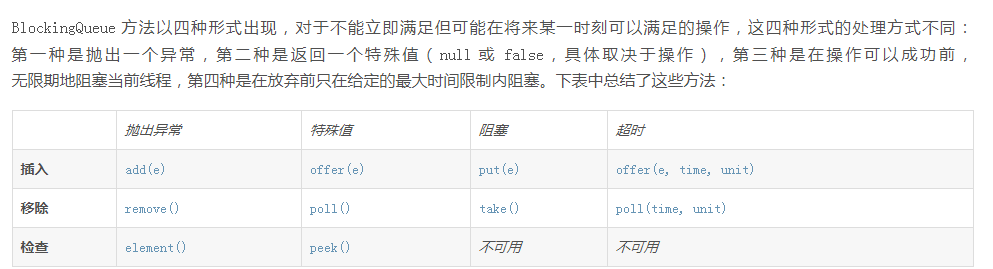

# 数据结构

### 常见结构
* Collection
    * Queue
    
    * List 有序重复
    * Set 无序不重复
* Map
    * HashMap 
        * 键和值允许空，底层数组的长度总是2的n次方，保证速度上的优化，数据在数组上分布比较均匀
            1. size 存放的KV树
            2. capacity 桶的数量
            3. loadFactor 衡量满的程度，size/capacity
            4. threshold size大于threshold会执行resize，capacity*loadFactor 
        * put操作
            1. 索引计算 : ((key.hashCode() ^ (key.hashCode() >>> 16)) & (table.length - 1))
            2. 在链表中查找，并记录链表长度，若链表长度达到了 TREEIFY_THRESHOLD(8)，则将该链转成红黑树
            3. 若在链表中找到了，则替换旧值，若未找到则继续
            4. 当总元素个数超过容量*加载因子时，扩容为原来 2 倍并重新散列，元素的下标要么不变，要么变为原下标+原容量
            5. 将新元素加到链表尾部
    * TreeMap
        基于红黑树，损耗在插入删除，键值都不能为空，效率低，但总是根据指定的规则保持有序状态
    * HashTable 
        键和值不允许空
        
### hash冲突的解决办法
* 开放地址法（再散列法）
* 再哈希法
* 链地址法（拉链法） hashmap采用
* 建立公共溢出区

### LRU

    LinkedHashMap(HashMap+双向链表)
    
### Arrays.sort原理
* 首先检查数组长度，如果比阀值（286）小，直接使用双轴快排
    > 类似三向切分的快速排序，分三段结果段，一段未知段，两个pivot
* 否则先检查数组中数据的连续性，标记连续升序，反转连续降序，如果连续性好，使用 TimSort 算法（可以很好的利用数列中的原始
顺序）
    > TimSort是归并排序的优化，先按连续区分run，再根据Galloping(合并时机和方法)合并，最优复杂度O(n)
* 否则使用双轴快排 + 成对插入排序