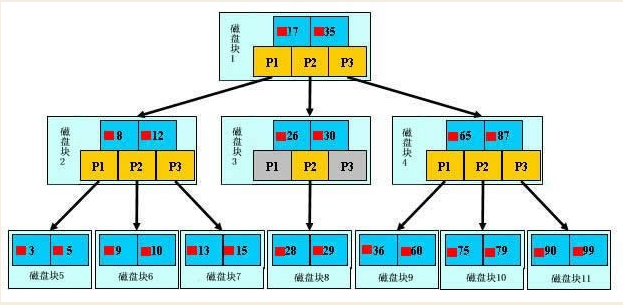
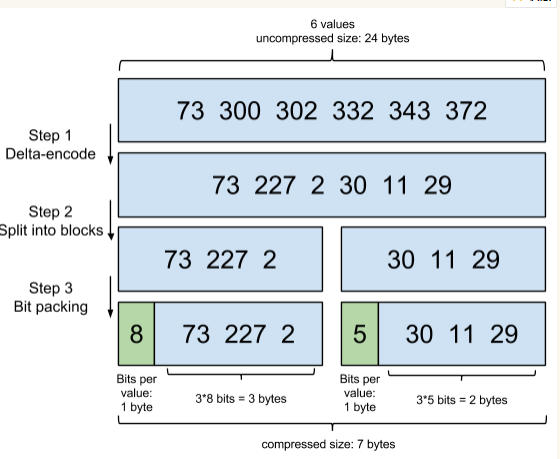
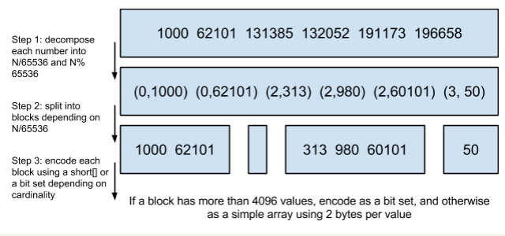

# Mysql

### 原理

 

一个磁盘块包含数据项和指针，并且通过指针串在一起，这样就很容易的进行区间遍历甚至全部遍历

查找过程(查找29):

    1. 将磁盘快1加载至内存，发生一次IO，二分查找锁定磁盘块1的指针2
    2. 将磁盘快3加载至内存，发生一次IO，二分查找锁定磁盘块3的指针2
    2. 将磁盘快8加载至内存，发生一次IO，二分查找锁定数据
    
性质：

    * 索引要尽量小 
        IO次数取决于树的高度，假设数据表数据为N，每个磁盘块的数据项数量为m，则高度h=log(m+1)N，而m=磁盘块大小/数据项大小，
        因此数据项所占空间越小，高度越低，这也是为什么真是数据要放在叶子节点。
    * 索引的左匹配特性
    
### 索引分类

    * 普通索引
    * 唯一索引
        * 主键索引
        * 唯一索引
    * 联合索引
    * 全文索引
    * 空间索引
    
    * 单列索引
    * 组合索引 最左前缀原则
    
    * 聚集索引 索引的键值逻辑顺序决定了表数据行的物理存储顺序，一张表只能有一个聚集索引，mysql不能单独创建，默认为主键
    * 非聚集索引 也叫二级索引
    
    * 覆盖索引 需要存储列的值，因此BTree才有，代表执行计划中extra列的using index
    
    
### 索引类型
    * hash 查询单条快，范围查询慢，innodb、myisam不支持
    * btree 层数越多，数据量指数级增长
    * fulltext myisam不支持
    * rtree 比btree强于范围查找 myisam不支持

# Mongo

### 架构模式

* Replica set
* Sharding cluster
* Master slave

### 原理

    * 分布式文件存储的文档数据库
    * 内部结构为collection+extent链表，extent包含多个文档信息，文档信息采用bson结构
    * 底层文件存储采用.ns+数据文件，数据文件按数据量增加
    * 索引存储B-树结构，key和data放在一起，最好复杂度低，适合数据模型简单查找
    * 分片部署，按片键划分chunk，配置文件服务器存储的是片键与chunk以及chunk与server的映射关系
    * 读数据，先路由拿配置信息，再到任意server读取。写数据，先路由拿配置信息，在写入主节点，由主节点同步到其他节点
    
# ElasticSearch
    
### 原理
    
    * 全文本搜索引擎，分布式实时文档存储
    * index（数据库） type（数据表，可以逻辑分区） document（数据）
  
### 操作流程

* 写(协调->主分片->副本分片)
1. 写入内存及translog文件
2. 每1秒刷新至缓存构建segment，可供查询
3. 每5秒时间或是一次写入请求完成后将translog写入磁盘，结果返回客户端
4. 每30分钟或者translog变大，将segment写入磁盘，删除translog
5. 这期间合并多个segment
* 读
1. 索引分片拷贝，返回给协调节点汇总
2. 获取符合要求的文档返回客户端

### 索引原理

* 倒排索引
* FST通过term index定位offset
* 增量编码压缩posting list 

* Roaring bitmaps压缩

* 联合索引跳表查询

# 树介绍
* B树（B-树） 每个节点存储key和data，叶子节点指针为空
* B+树 只有叶子节点存储data，也不存储指针
* B*树 B+树上增加兄弟节点的指针
* R树 Rectangle地图查找
* Trie树 字典数
