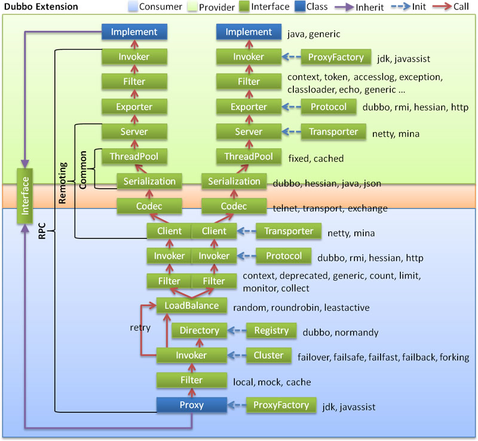

# Dubbo

### 架构分层
    * 服务接口层 与业务相关
    * 配置层 以ServiceConfig和ReferenceConfig为中心
    * 服务代理层 生成服务的客户端和服务端，以ServiceProxy为中心
    * 服务注册层 封装服务地址的注册和发现，以服务URL为中心
    * 集群层 封装多个服务者的路由和负载均衡，并桥接到注册中心，以Invoker为中心，将多个
    服务组合为一个，实现对消费方的透明
    * 监控中心 以Statistic为中心
    * 远程调用层 封装RPC调用，以Invocation和Result为中心，
    * 信息交换层 封装请求响应模式，同步转异步，以Request和Response为中心
    * 网络传输层 抽象mina和netty为统一接口，以Message为中心
    * 数据序列化层 可复用的一些工具
    
### 说明
> Protocol是核心层，也就是只要有Protocol + Invoker + Exporter就可以完成非透明的RPC调用

### 执行流程

    调用
    1. 初始化解析服务
    2. 生成Invoker实例（ProxyFactory）
    3. 转化为Exporter（Protocol）
    
    消费端
    1. 初始化解析配置
    2. 生成Invoker实例
    3. 转化为客户端需要的接口

### 项目模块
    * dubbo-common 公共逻辑模块，包括Util类和通用模型
    * dubbo-remoting 远程通讯模块，dubbo协议的实现
    * dubbo-rpc 远程调用模块，抽象各种协议，以及动态代理
    * dubbo-cluster 集群模块，将多个提供方伪装成一个
    * dubbo-registry 注册中心模块，基于注册中心下发地址的集群方式，以及各种注册中心的抽象
    * dubbo-monitor 监控模块
    * dubbo-config 配置模块，对外API
    * dubbo-container 容器模块
    
### 负载均衡策略
    * Random 随机（默认）
    * RoundRobin 轮询
    * LeastActive 最少活跃调用数
    * ConsistentHash 一致性Hash
    
### 集群容错模式
    * Failover 失败自动切换，用于读操作（默认）
    * Failfast 失败立即报错，用于非幂等的写操作
    * Failsafe 失败忽略，用于日志
    * Failback 失败自动恢复，后台记录失败请求，定时重发，用于消息通知
    * Forking 并行调用多个服务器，一个成功就返回，用于实时要求高的读操作
    * Broadcast 广播所有提供者，逐个调用，有一个失败则报错，用于通知所有提供者更新缓存或日志等本地资源信息
    
### 序列化
    * dubbo
    * hession 默认
        着重于数据，附带简单的类型信息的方法。就像Integer a = 1，hessian会序列化成I 1这样的流，I表示int or Integer，1就
        是数据内容。而对于复杂对象，通过Java的反射机制，hessian把对象所有的属性当成一个Map来序列化，产生类似
        M className propertyName1 I 1 propertyName S stringValue（大概如此，确切的忘了）这样的流，包含了基本的类型描述和
        数据内容。而在序列化过程中，如果一个对象之前出现过，hessian会直接插入一个R index这样的块来表示一个引用位置，从而
        省去再次序列化和反序列化的时间。这样做的代价就是hessian需要对不同的类型进行不同的处理（因此hessian直接偷懒不支持
        short），而且遇到某些特殊对象还要做特殊的处理（比如StackTraceElement）。而且同时因为并没有深入到实现内部去进行序
        列化，所以在某些场合会发生一定的不一致，比如通过Collections.synchronizedMap得到的map
    * json
    * java
        Java序列化会把要序列化的对象类的元数据和业务数据全部序列化从字节流，而且是把整个继承关系上的东西全部序列化了。
        它序列化出来的字节流是对那个对象结构到内容的完全描述，包含所有的信息，因此效率较低而且字节流比较大。但是由于确实
        是序列化了所有内容，所以可以说什么都可以传输，因此也更可用和可靠。
       
### 源码

* 服务端
1. Spring解析生成ServiceBean
2. ServiceConfig通过代理将接口转换为Invoker
3. ServiceConfig通过Protocol生成Exporter
    1. 通过SPI找到对应Protocol
    2. 调用具体通信框架开启服务
    
* 消费端
1. Spring解析生成ReferenceBean
2. ReferenceConfig通过Protocol生成对应Invoker
    1. 通过SPI找到对应Protocol
3. ReferenceConfig集群组合多个Invoker
4. ReferenceConfig将Invoker转化为代理对象
    1. 代理对象实际是调用的Invoker的doInvoker方法
    2. doInvoker方法里调用通信框架发送数据
    
### 对比

* vs Spring Cloud
    响应快
    基于RPC，而非http调用
    主要实现服务治理，而非整个微服务架构
    内部架构较为复杂
    依靠单独jar管理仓库
    分布式其他组件需要单独实现整合