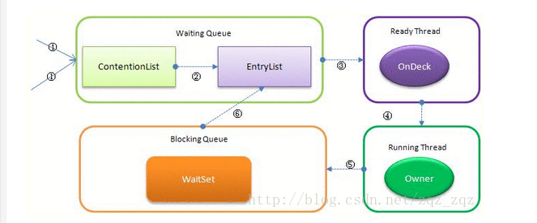

# JAVA LOCK

### ReentrantLock

    内部通过自定义Sync（继承AbstractQueuedSynchronizer）实现
    NonfairSync和FairSync对应Sync的两个实现，默认采用非公平锁
    
### AQS

    内部构造Node对象，维护一个双向链表
    Node节点和变量state都是volatile，保证线程之间可见性
    
* 同步器加锁步骤
    
    1. tryAquire 尝试获取锁
    2. addWaiter 构造节点添加到尾部
    3. acquireQueued 让节点以死循环获取同步状态，若成功就退出循环，内部通过Node状态判断挂起还是获取
    
### ReentrantReadWriteLock

    内部通过自定义Sync实现
    NonfairSync和FairSync对应Sync的两个实现，默认采用非公平锁
    内部有ReadLock和WriteLock两个锁
    为了保证线程间内容的可见性，读锁和写锁是互斥的，这里的互斥是指线程间的互斥，当前线程可以获取到写锁又获取到读锁，但是获取到了读锁不能继续获取写锁
    读写锁依托于AQS的State变量的位运算来区分读锁和写锁，高16位表示读锁，低16位表示写锁
    
### synchronize

    * Contention List 
        竞争队列，所有请求锁的线程首先被放在这个竞争队列中
    * Entry List 
        Contention List中那些有资格成为候选资源的线程被移动到Entry List中
    * Wait Set
        哪些调用wait方法被阻塞的线程被放置在这里
    * OnDeck
        任意时刻，最多只有一个线程正在竞争锁资源，该线程被成为OnDeck
    * Owner
        当前已经获取到所资源的线程被称为Owner
        
        
    执行过程： 
    1. 检测Mark Word里面是不是当前线程的ID，如果是，表示当前线程处于偏向锁 
    2. 如果不是，则使用CAS将当前线程的ID替换Mard Word，如果成功则表示当前线程获得偏向锁，置偏向标志位1 
    3. 如果失败，则说明发生竞争，撤销偏向锁，进而升级为轻量级锁。 
    4. 当前线程使用CAS将对象头的Mark Word替换为锁记录指针，如果成功，当前线程获得锁 
    5. 如果失败，表示其他线程竞争锁，当前线程便尝试使用自旋来获取锁。 
    6. 如果自旋成功则依然处于轻量级状态。 
    7. 如果自旋失败，则升级为重量级锁。
    
### 锁优化

    * 减少锁时间
    * 减少锁粒度
    * 合理锁粗化 循环情况
    * 使用读写锁
    * 读写分离锁 CopyOnWriteArrayList
    * volatile+cas
    * 消除缓存行的伪共享
    
### 死锁
* 条件
    * 互斥条件
    * 占有和等待条件
    * 不剥夺条件
    * 循环等待
* 预防
    * 设置加锁顺序
    * 设置加锁时限
    * 死锁检测