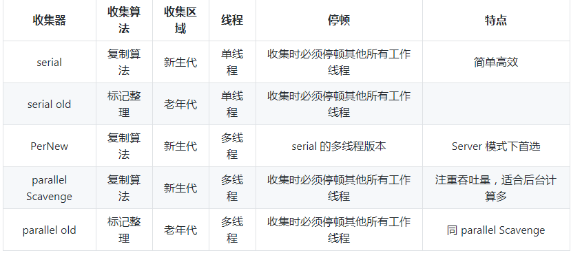
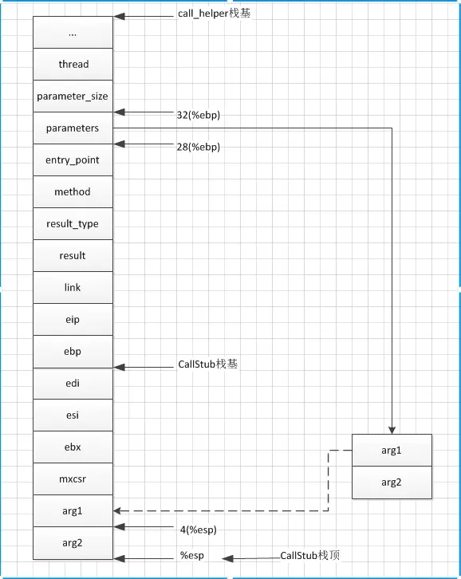

# JVM

### 组成

    * 程序计数器 当前线程所执行的字节码的行号指示器
    * 虚拟机栈 java方法执行的内存模型，每个方法被执行会创建一个栈帧，用于存储局部变量表、操作栈、动态链接，方法出口等，一个方法的调用完成就是
    栈帧在虚拟机栈中入栈出栈的过程
    * 本地方法栈
    * java堆
        * Eden区
        * From Survivor To Survior
    * 方法区 各个线程共享的内存区域，用于存放加载的类信息、常量、静态变量、即时编译的代码等。jdk8元数据区取代永久带，且
    使用的本地内存
    * 运行时常量池 方法区的一部分，存放编译器生成的各种字面量和符号引用
    * 直接内存
    
### 对象访问方式
    句柄访问 堆中划分出一块句柄池，reference存储句柄地址
    直接指针访问 reference存储对象地址
    
### 参数配置
   * 栈大小通过-XSs配置，不足引起StackOverflowError
   * 堆内存通过-Xms配置，默认是物理内存的1/64，最大内存由-Xmx配置，默认为物理内存的1/4，当空余堆小于40%时，会增大到设置
   的-Xmx大小，阈值比例由-XX:MinHeapFreeRatio设置，空余内存大于70%时，会减少至-Xms大小，阈值比例由-XX:MaxHeapFreeRatio设
   置。
   
# 垃圾回收

### 标记方式
    * 引用计数 无法解决循环引用的问题
    * 可达性分析
    
### 回收方法
    * 标记清除 减少停顿时间，但会造成内存碎片
    * 复制 适合大量回收的场景，比如新生代回收
    * 标记整理 解决碎片问题，但会增加停顿时间
    * 分带收集 每种区域采取不同回收方式，即新生代复制（minor gc），年老带标记整理（major gc）
    
### 组成
    
    * 年轻带 1/3
        Eden 8/10
        Survivor0 1/10
        Survivor1 1/10
        -XX:InitialSurvivorRatio设置Eden/Survivor比例
        -Xmn设置年轻带大小
    * 年老带 2/3
        -XX:Newratio设置Old/Young比例
    * 永久带
        -XX:PermSize -XX:MaxPermSize

### 回收过程
    1. 触发minor gc时，Eden中存活对象复制到to Survivor中
    2. 再看from Survivor，如果次数达到年老带标准，就复制到年老带，如果没有则复制到to Survivor，如果to Survivor满了，则
    复制到年老带
    3. 然后调换from Survivor和to Survivor，保证to Survivor是空的等待对象复制
    
### 触发时机
    * minor gc
        * eden区满
    * full gc
        * 老年代空间不足以支持下一次minor gc
        * 用户调用System.gc,但是否执行由JVM决定
    
### 垃圾回收器

    * 并发标记清除 CMS 
        * 初始标记-并发标记-重新标记-并发清除
        * 配置复杂，合理的低停顿，用于中等或更小的堆
    * G1 
        * 初始标记-并发标记-最终标记-筛选回收
        * 划分Region，按优先级回收
        * 不用配置，低停顿，用于大容量的堆，牺牲了吞吐量和堆空间（标记整理算法势必需要较大堆空间）
        

    选择垃圾收集器因素：
    1. 吞吐量（Parallel Scavenge关注）
        用户CPU利用率，适合后台计算
    2. 停顿时间
        减少停顿时间，新生代减小，回收更频繁，势必会牺牲吞吐量
    3. 堆容量 
### java内存模型

    定义了各个变量的访问规则，即在JVM中将变量存储和取出的底层细节
    * 主内存
    * 工作内存
    
### java内存模型承诺
    * 原子性
    * 指令重排
        * 编译器优化重排
        * 处理器指令重排
        * 内存系统重排
    * 可见性
    * 有序性

### volatile

    * 保证修饰的变量对所有线程可见
    * 禁止重排序
    
### 类加载顺序
    * Bootstrap 启动类 $JAVA_HOME中jre/lib/rt.jar里所有的class
    * Extension 扩展类 $JAVA_HOME中jre/lib/*.jar或-Djava.ext.dirs指定目录下的jar包
    * App 系统类 classpath中指定的jar包及目录中class
    * Custom 自定义类 
    先检查类是否被已加载，检查顺序是自底向上，而加载的顺序是自顶向下，也就是由上层来逐层尝试加载此类。
    
### happens-before
    
> JMM向程序员提供的happens-before规则能满足程序员的要求，JMM的happens-before规则不但简单易懂，而且也向程序员提供了足够强的内存可见性保证

    * 程序顺序规则：一个线程中的每个操作，happens-before 于该线程中的任意后续操作。
    * 监视器锁规则：对一个监视器锁的解锁，happens-before 于随后对这个监视器锁的加锁。
    * volatile变量规则：对一个volatile域的写，happens-before 于任意后续对这个volatile域的读。
    * 传递性：如果A happens-before B，且B happens-before C，那么A happens-before C。
    * Thread.start()的调用会happens-before于启动线程里面的动作。
    * Thread中的所有动作都happens-before于其他线程从Thread.join中成功返回。
    
### 调优命令
    * jps 输出jvm运行的进程状态信息
    * jstack 查看某个java进程内的线程堆栈信息（查看运行时间过长）
        1. 查询cpu利用率高的pid
        2. jstack导出栈信息
        3. pid转16进制在栈信息中对应nid值数据
    * jmap 查看堆内存使用情况（查看内存泄漏）
    * jstat JVM统计监测工具（查看gc）
    
### 引用类型
* 强引用 StrongReference
    new出来的对象
* 软引用 SoftReference
    * 内存不足，垃圾回收器会回收
    * 可实现内存敏感的高速缓存
    * 可以和ReferenceQueue使用
* 弱引用 WeakReference
    * 更短暂的生命周期，一旦发现只有弱引用的对象，不管内存如何，都会回收
    * 可以和ReferenceQueue使用
* 虚引用 PhantomReference
    * 和没有引用一样，在任何时候都会被回收
    * 用来跟踪被垃圾回收器回收的活动
    * 必须和ReferenceQueue使用
   
###  虚拟机
* 分类
    * JRocket BEA
    * Hotspot SUN（早期为Classic VM/EXACT VM）
    * J9 IBM
* 发起垃圾回收
    1. 构建OoMap快速定位引用
    2. 安全点优化OoMap空间成本，挂起线程扩展成为安全区域
        * 抢先式中断
        * 主动式中断（采用）

### 底层原理
* 中间语言到机器语言
    1. C语言逐个翻译成机器语言（效率低）
        
        定义函数(JVM引擎中函数解释)指针(寄存器CS+IP)，指向入口
    2. 中间语言直接翻译成机器语言
        
        翻译成JVM指令(iload istore)(对应操作数栈)，再到机器指令(mov pop)(对应寄存器)
        
* 机器语言执行流程（结合栈图）
1. 分配地址空间
2. 存储变量值
3. 变量压入栈栈顶
4. 调用函数（流程和主流程类似）
5. 将返回值放入栈底

* 各部分名称
    * esp 栈指针寄存器
    * edp 基址指针寄存器
    * eip 指令寄存器，指针永远指向下一条等待执行的指令地址
    
* JVM调用
    * 字节码中一条JVM指令对应多条汇编指令
    * call_stub_entry转换成CallStub函数指针，调用该函数指针完成方法调用
    * generate_call_stub完成_call_stub_entry的初始化
        1. _pc()计算当前起始位置
        2. CallStub各个参数地址计算
        3. _enter保存调用者堆栈
        4. 动态分配CallStub堆栈（基址+参数个数）
        5. 调用者信息保存（edi，esi，ebx）
        6. 参数入栈
        7. 函数调用（entry_point）
        
        
* JAVA数据结构
    * 编译成字节码（跨平台），运行时实现（还原原始结构）
    * class文件各组成
        1. MagicNumber 固定表示class文件
        2. Version 版本
        3. 常量池（包括字面常量和符号引用）
    * opp-klass模型
        1. opp 描述对象实例信息
        2. klass 描述java类
    * 大端小端（网络协议，跨平台兼容考虑）
        * 低位高位字节和内存低位高位不一致
        * 本质产生原因由于寄存器是数据指令必经中转，寄存器容纳多字节，内存单元始终一字节
        * JVM调用转换接口防止校验失败
        
* 字节码解读
    * 查看方式分为字节码指令和16进制数据
    * 数据依次为魔数版本、常量池、字段、方法，具体含义由各个结构规范表定义
    * JVM参照固定的规范结构解释字节码数据
    
* 字节码常量池解析
    * 分配内存常量池内存（构造constantPoolOop）与解析常量池信息
    * 构造constantPoolOop用于存储常量池信息，constantPoolOop的meta指向constantPoolKlass，constantPoolKlass的meta又指向klassKlass
    * constantPoolOop的tags和数据区遵循字节码数据格式存放类型值和索引值
    * oop/klass/handle体系及相互转换
    * klassKlass构建步骤（constantPoolKlass/constantPoolOop与其类似）
        1. 申请内存
        2. 内存清零
        3. 初始化mark
        4. 初始化metadata
        5. 初始化klass
        6. 自指（针对klassKlass）
        
* 类变量解析
    内存对齐和字段重排使得节省内存
    
* JAVA栈帧
    * entry_point -> generate_method_entry -> generate_normal_entry
    * java基于栈式指令集，操作系统基于寄存器指令集
    * 堆栈存放栈帧，栈帧存放操作栈、帧数据和局部变量表
    * 创建栈帧步骤
    * 局部变量表与slot复用
    
* 类方法解析
    * 方法属性解析复制
    * methodOop创建（类似常量池Oop创建）
    * 编译器自动生成clinit与init方法，并添加初始化代码块到其中
    * vtable（instanceKlassOop内存末尾）
    
* 执行引擎
    * 取指
    * 译码
        * 模板表（识别操作码和操作数）
        * 四个层次的汇编器（为字节码生成机器码）
    * 栈顶缓存、栈帧重叠
    
* 类生命周期
    * instanceKlass和对应镜像类Class
    * 引导加载器对应C++结构，扩展、系统加载器对应Java结构
    * 栈上分配与逃逸分析
    * TLAB
        

## 编译器与解释器
    JIT编译将代码编译成本地机器码，提高效率
    
    C1 Client Compiler
        提高编译速度
    C2 Server Compiler
        提高编译质量