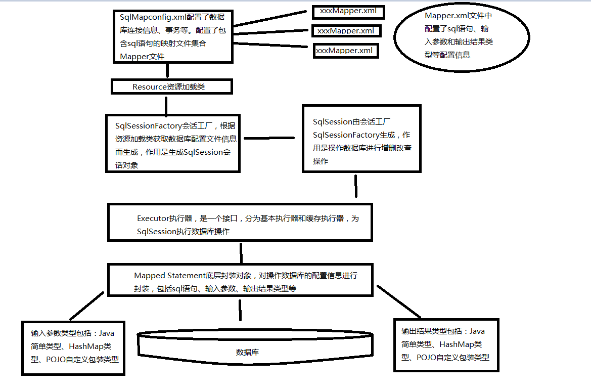

# Mybatis

### 主要成员

* Configuration 配置对象
* SqlSession 操作Api顶层接口，和数据库交互的会话
* Executor 执行器，负责Sql生成和缓存维护
* StatementHandler 封装JDBC Statement操作
* ParameterHandler 参数转换
* ResultSetHandler 返回结果处理
* TypeHandler 类型映射转换
* MappedStatement 节点封装
* SqlSource 根据parameterObject动态生成Sql并封装成BoundSql
* BoundSql 动态生成的Sql对象

### 执行过程



1. 创建SqlSessionFacotry

2. 创建SqlSession

3. 创建Mapper

4. 执行CRUD


### 缓存

* 一级缓存

    SqlSession级别，默认开启
    
    查询调用BaseExecutor，组装key（组装updateList）查询本地缓存，有则直接返回，没有则查询数据库，更新时清除缓存
    
* 二级缓存

    Mapper级别，默认不开启
    ```
    <settings>
        <setting name="cacheEnabled" value="true"/>
    </settings>
    ```
    
    SqlSessionFactoryBuilder先初始化cache，执行查询调用CacheExecutor，如果缓存有则直接返回，没有则查询数据库。

mybatis-generator:generate