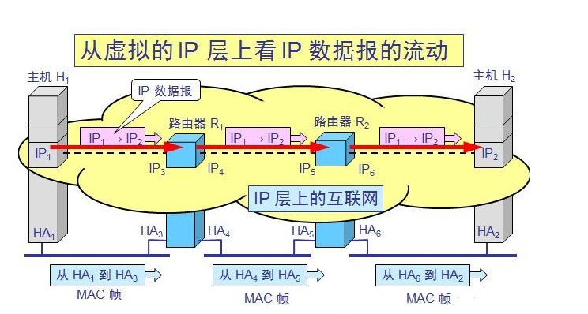

# Network

### 概述
* 核心部分（路由器）和边缘部分（主机）
* ISP 互联网服务提供商
* 电路交换，报文交换，分组交换

### 物理层
* 传输媒体
    * 导向性传输介质
        1. 双绞线
        2. 同轴电缆
        3. 光纤
    * 非导向性传输介质
        1. 无线电波
        2. 微波
* 信道复用技术
* 宽带接入技术
    * xDSL
    * FTTx
    * 光纤
    
### 物理链路层
* 概念
    * 封装成帧
    * 透明传输
    * 差错检测
* PPP点对点
  * 工作状态 物理链路->LCP链路->NCP链路
* 广播信道
  * CSMA/CD
    1. 多点接入
    2. 载波监听
    3. 碰撞检测
    
### 网络层
* IP报文和分类
* ARP和RARP(DHCP)
  
* 划分子网
    * 子网掩码
* 构成超网
    * 无分类编制(CIDR)
    * IP地址路由算法
* ICMP
    * ping
    * tracert
* 内部网关协议(RIP)
    * 路由表产生算法