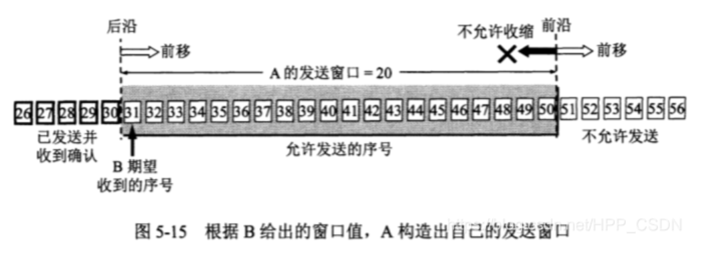
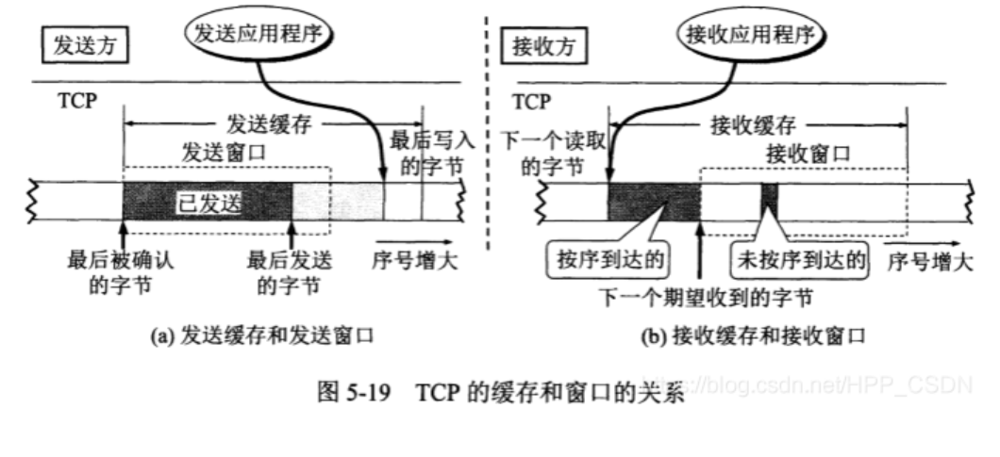

# Network

### 概述
* 核心部分（路由器）和边缘部分（主机）
* ISP 互联网服务提供商
* 电路交换，报文交换，分组交换

### 物理层
* 传输媒体
    * 导向性传输介质
        1. 双绞线
        2. 同轴电缆
        3. 光纤
    * 非导向性传输介质
        1. 无线电波
        2. 微波
* 信道复用技术
* 宽带接入技术
    * xDSL
    * FTTx
    * 光纤
    
### 物理链路层
* 概念
    * 封装成帧
    * 透明传输
    * 差错检测
* PPP点对点
  * 工作状态 物理链路->LCP链路->NCP链路
* 广播信道
  * CSMA/CD
    1. 多点接入
    2. 载波监听
    3. 碰撞检测
    
### 网络层
* IP报文和分类
* ARP和RARP(DHCP)
  
* 划分子网
    * 子网掩码
* 构成超网
    * 无分类编制(CIDR)
    * IP地址路由算法
* ICMP
    * ping
    * tracert
* 内部网关协议
  * RIP
    * 路由表产生算法
  * OSPF
* 外部网关协议
  * BGP
* 路由器构成 
  * 输入端口 交换接口 输出端口
* IP多播
  * IGMP
  * 多播路由选择协议
* VPN（专用隧道）和NAT（内部IP和接入互联网IP转换）

### 运输层
* UDP
* TCP
  * 停止等待协议
  * 滑动窗口ARQ协议
  * 可靠传输的实现
    
    
  * 流量控制 
    计算公式
  * 拥塞控制
    * 慢开始 拥塞避免
    * 快重传 快恢复
    * 随机早期检测RED避免尾部丢弃策略引起的拥塞
  * 链接管理
    * 三次握手
        * 防止已失效的连接请求报文段
    * 四次挥手
        * 防止服务端最后确认丢失而造成的无法关闭
        * 防止已失效的连接请求报文段
    * 有限状态机
        * 服务端  CLOSED -> LISTEN -> SYN-RCVD -> ESTABLISHED -> CLOSE-WAIT -> LAST-ACK -> CLOSED
        * 客户端  CLOSED -> SYN-SENT -> ESTABLISHED -> FIN-WAIT-1 -> FIN-WAIT-2 -> TIME-WAIT -> CLOSED
  
### 会话层
* DNS
  * 分布式管理
  * 根域名服务器 顶级域名服务器 权限域名服务器 本地域名服务器
  * 递归查询 迭代查询
  * 高速缓存