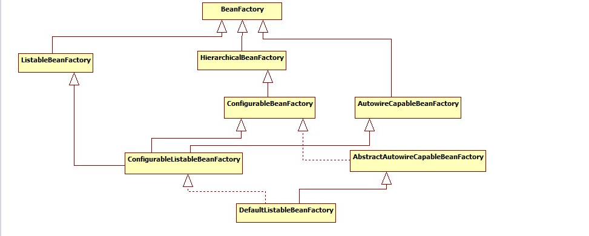
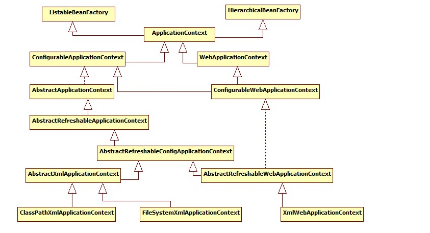

# Spring
+++++++++
## IOC

* 控制反转

    把创建对象和维护之间的关系的权利由程序中转移到Spring容器
        
* 依赖注入
    
    IOC的另一种表现形式
    
### 注入方式

    * 接口注入
    * 构造器注入
    * set注入
    * 注解注入
   
### AOP
    * 面向切面编程
    
    
### 生命周期
    1. 实例化BeanFactoryPostProcessor
    2. 实例化BeanPostProcessor
    3. 实例化InstantiationAwareBeanPostProcessorAdapter
    4. 执行InstantiationAwareBeanPostProcessor的postProcessorBeforeInstantiation
    5. 执行bean构造器
    6. 执行InstantiationAwareBeanPostProcessor的postProcessorPropertyValues
    7. 调用BeanNameAware的setBeanName
    8. 调用BeanFactoryAware的setBeanFactory
    9. 执行BeanPostProcessor的postProcessInstantiation
    10. 调用initialzingBean的afterPropertiesSet
    11. 调用bean的init_method的属性指定的初始化方法
    12. 执行BeanPostProcessor的postProcessAfterInstantiation
    13. 执行InstantiationAwareBeanPostProcessor的postProcessAfterInitialization
    14. 初始化执行成功，程序使用bean
    15. 调用DisposableBean的destroy方法
    16. 调用bean的destory_method属性指定销毁方法

    * 静态
    * jdk
        速度快，需要接口
    * cglib
        性能好
    
    spring自动在两种动态代理切换
    
### 执行过程(ClassPathXmlApplicationContext)
1. 基础参数初始化校验
2. XmlBeanDefinitionReader中由BeanDefinitionDocumentReader通过BeanDefinitionParserDelegate解析标签构建BeanDefinitionHolder，再由BeanDefinitionRegistry注册BeanDefinition(XmlBeanFactory只有这步)
    * 默认标签解析
        1. 默认属性解析
        2. 自定义属性解析 
            spring.handlers spring.schemas
    * 自定义标签解析 
        spring.handlers spring.schemas
3. beanFactory参数配置
4. postProcessBeanFactory自定义功能
5. 实例化执行beanFactoryPostProcessors
6. 实例化注册beanPostProcessors
7. 初始化messageSource国际化属性
8. 初始化applicationEventMulticaster消息广播类
9. onRefresh自定义初始化额外内容
10. 注册listeners
11. doGetBean实例化bean
    1. 先获取缓存，有则直接返回
    2. 递归父级beanfactory检验查找bean
    3. 递归获取当前bean的依赖并注册
    4. createBeanInstance，触发依赖注入populateBean，执行aware、beanPostProcessors等增强方法
12. finishRefresh初始化lifecycle，发送事件
13. finally重置缓存

### 类结构

    
### 其他功能
* SmartInitializingSingleton 所有非lazy单例Bean实例化完成后的回调方法
* SpEL编译模式
* TypeConverter 类型转换