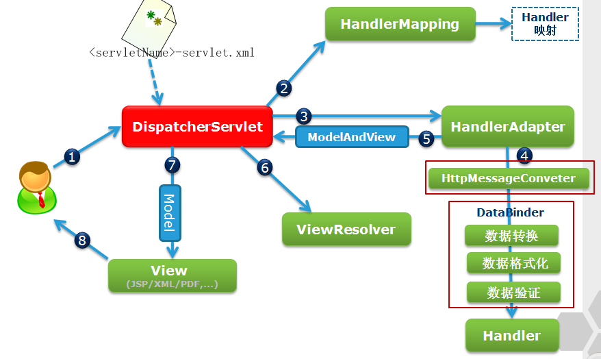

# SpringMVC

### 主要组件
* DispatcherServlet
    
    前端控制转发器
    
* HandlerMapping
    
    处理器映射器，根据URL找到Handler
    
* HandlerAdapter
    
    根据规则执行Handler
    
* View Resolver
    
    视图解析器
    
* View

    视图
    
### 执行流程

1. 发起请求到转发器
2. 通过HandlerMapping查找Handler(包括拦截器，以HandlerExecutionChain返回)
3. 适配器执行Handler
4. Handler执行完毕适配器返回ModleAndView
5. 视图解析器返回视图
6. 响应结果