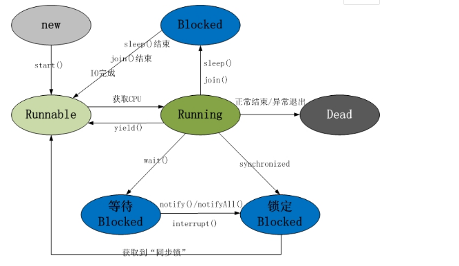

# 线程

    * wait 
        1. Object
        2. 释放了锁
        3. 只能在同步方法或同步块里使用
        4. 不需要捕获异常
    * await
        1. 依赖锁机制，更加灵活
    * sleep 
        1. Thread
        2. 没有释放锁
        3. 在任意地方使用
        4. 需要捕获异常
    * yield
        1. 暂停当前正在执行的线程
        2. 没有释放锁
        3. 使当前线程重新回到可执行状态
        4. 能使同优先级或者高优先级的线程得到执行机会
    * join
        1. 等待该线程终止
    * notify
        1. 与wait对应
    * signal
        1. 与await对应
        
### 中断
   * interrupt() 中断当前阻塞线程
   * interrupted() 设置中断标识，静态方法
   * isInterrupted() 判断中断标识